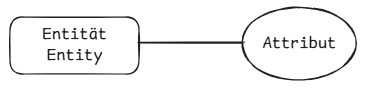
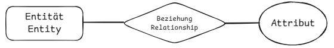

# TASK_039

## Grundlagen der Datenmodellierung

### Begriffe verstehen: Entitäten, Attribute, Beziehungen

- **Entität (Entity):** Eine Entität ist ein Ding oder eine Person, über die wir Informationen speichern.
- **Attribut (Attribute):** Ein Attribut ist eine Eigenschaft, die eine Entität beschreibt.
- **Beziehung (Relationship):** Eine Beziehung zeigt, wie zwei Entitäten miteinander verbunden sind.#

**Beispiele**

1. Handy, Handyhülle (Entity) --> System, Kamera, Große ... (Attribut) --> Hnady gehört zu einer Person, Handy hat eine Handyhülle (Beziehung)
2. Restaurant, Tish --> Ort, Typ, -->Restaurant hat Tische , Kunde reserviert einen Tisch

### Unterschied zwischen logischem und physischem Datenmodell

- **Logisches Datenmodell**: Zeigt, was gespeichert wird und wie die Daten zusammenhängen, ohne zu sagen, wie sie technisch gespeichert werden.
- **Physisches Datenmodell**: Zeigt, wie die Daten tatsächlich in einem System gespeichert werden, z.B. Tabellen, Spalten oder Speicherort.

## Entity-Relationship-Modell

### Darstellung von Entitäten und Beziehungen im ER-Modell

1. **Entitäten** werden als Rechtecke dargestellt.

2. **Attribute** werden als Ovale dargestellt und mit Linien mit ihren Entitäten verbunden.

3. **Beziehungen** werden als Rauten dargestellt und mit Linien zu den beteiligten Entitäten verbunden.

### Kardinalitäten in ER-Diagrammen erkennen und beschreiben

- **1:1 (Eins zu Eins)**: Eine Entität A ist mit genau einer Entität B verbunden und umgekehrt.

  

- **1:N (Eins zu Viele)**: Eine Entität A ist mit mehreren Entitäten B verbunden, aber jede Entität B ist nur mit einer Entität A verbunden.
  
- **N:M (Viele zu Viele)**: Mehrere Entitäten A sind mit mehreren Entitäten B verbunden.

  
